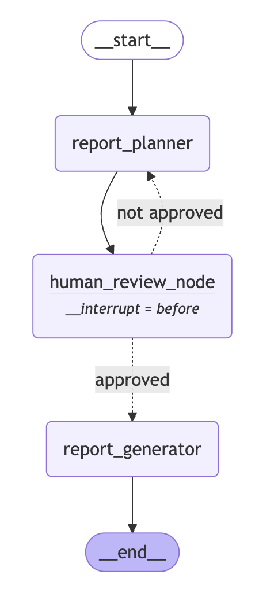

# Research Assistant Agent

## Modular Multi-Provider Research System

A scalable research assistant with **modular architecture** supporting multiple LLM providers and extensible workflow nodes.

### Features

- **Modular Architecture** - Pluggable components for maximum flexibility
- **Multi-LLM Support** - Easy switching between Ollama, OpenAI, Anthropic
- **Interactive Workflow** - Human review and approval steps
- **Extensible Nodes** - Add new research capabilities easily  
- **Structured Generation** - JSON-constrained llm output for reliability
- **Web Interface** - Streamlit UI for easy interaction
- **Configuration-Driven** - YAML-based workflow management
- **RAG Integration** - Retrieval-augmented generation with Chroma vector store

### Agent Graph



### Quick Start

1. **Install dependencies:**
   ```bash
   pip install -r requirements.txt
   ```

2. **Setup LLM Provider and RAG:**
   ```bash
   # For Ollama (default)
   ollama serve
   ollama pull llama3.2
   ollama pull nomic-embed-text  # for RAG embeddings
   
   # For OpenAI (coming soon)
   export OPENAI_API_KEY="your-key"
   
   # For Anthropic (coming soon)  
   export ANTHROPIC_API_KEY="your-key"
   ```

3. **Run the application:**
   ```bash
   # Web interface
   streamlit run main.py
   ```

### Configuration

#### Provider Settings (`config/settings.yaml`)
```yaml
llm_provider:
  type: "ollama"  # or "openai", "anthropic"
  
ollama:
  model: "llama3.2"
  base_url: "http://localhost:11434"
  embeddings_model: "nomic-embed-text"  # for RAG
  
openai:
  model: "gpt-4"
  temperature: 0.7
  
anthropic:
  model: "claude-3-sonnet"
  temperature: 0.7

rag:
  vector_store: "chroma"
  persist_directory: "data/vectorstore"
  chunk_size: 1000
  chunk_overlap: 100

workflow:
  enable_human_review: true
  max_retries: 3
  timeout: 300
```

#### Adding Custom Nodes
```python
from agents.nodes.base_node import BaseNode

class CustomAnalysisNode(BaseNode):
    def __init__(self, llm_provider):
        super().__init__(
            name="custom_analysis",
            llm_provider=llm_provider
        )
    
    def execute(self, state):
        # Your custom logic here
        return {"custom_results": "analysis_data"}
```

### Extending the System

#### Add New LLM Provider
1. Implement `BaseLLMProvider` interface
2. Add to `LLMProviderFactory`  
3. Update configuration schema

#### Add New Node Type
1. Extend `BaseNode` or `ConditionalNode`
2. Implement `execute()` method
3. Register in workflow configuration

### Further Details

For a deeper dive into the system's architecture, refer to [Architecture Details](architecture.md). This document provides an in-depth explanation of the modular design, workflow orchestration, and integration with multiple LLM providers.


### Troubleshooting

#### Common Issues

**LLM Provider Connection**
```bash
# Check Ollama status
ollama list
curl http://localhost:11434/api/version
```

**Configuration Issues**
- Verify `config/settings.yaml` syntax
- Check provider-specific environment variables
- Ensure model names match available models
