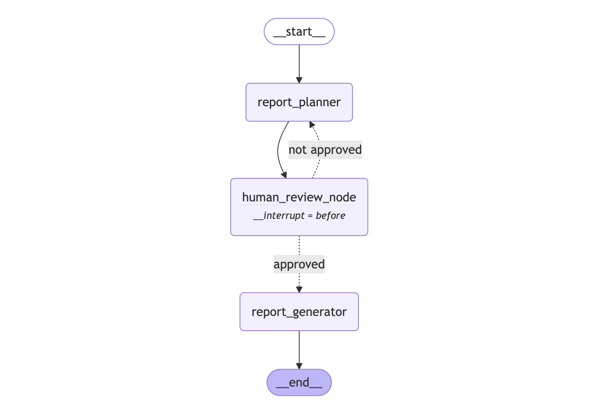

# Research Assistant Agent Architecture

## Project Overview
**Name:** Research Assistant Agent  
**Description:** Modular multi-provider AI research system with extensible workflow nodes and pluggable LLM providers. Built with flexible architecture supporting Ollama, OpenAI, Anthropic, and future providers. Features interactive human review, structured generation, and configuration-driven workflows.

**Goals:**
- Modular architecture enabling easy extension and maintenance
- Multi-provider LLM support with seamless switching capabilities
- Interactive workflows with human review and approval steps
- Structured JSON-constrained output for reliable data processing
- Configuration-driven workflow management

---


## Features
- **Modular Architecture** - Pluggable components with clear interfaces
- **Multi-LLM Provider Support** - Ollama, OpenAI, Anthropic with factory pattern
- **Interactive Workflow** - Human review nodes for quality control
- **Extensible Node System** - Easy addition of new workflow capabilities
- **Structured Generation** - JSON-constrained output with Pydantic models
- **State Management** - Centralized state validation and manipulation
- **Configuration-Driven** - YAML-based workflow and provider configuration
- **Enhanced UI** - Streamlit interface with provider selection and workflow info

---

## Software Architecture
### Modular Design Patterns
- **Provider Abstraction:** Factory pattern for LLM provider independence
- **Node-Based Architecture:** Extensible workflow nodes with clear interfaces
- **State Management:** Centralized validation and manipulation utilities
- **Builder Pattern:** Flexible workflow construction from configuration
- **Strategy Pattern:** Interchangeable node behaviors and provider implementations

### Implementation Architecture
- **LLM Provider Layer:**
  - Abstract base class defining provider interface
  - Concrete implementations for Ollama, OpenAI, Anthropic
  - Factory pattern for provider instantiation
  - Seamless provider switching without code changes

- **Node System Architecture:**
  - BaseNode abstract class for all workflow nodes
  - ConditionalNode for decision-making capabilities
  - Specialized nodes: ReportPlanner, HumanReview, ReportGenerator
  - Clear execute() interface for consistent behavior

- **State Management Layer:**
  - StateManager utility class for centralized operations
  - AgentState TypedDict for type-safe state structure
  - Validation methods for state integrity
  - State transition and update utilities

- **Graph Builder System:**
  - WorkflowBuilder for dynamic graph construction
  - ResearchWorkflowFactory for predefined workflows
  - Configuration-driven node assembly
  - Flexible routing and conditional logic

---


## Technologies
- **LLM Providers:** Ollama (llama3.2), OpenAI, Anthropic
- **Orchestration:** LangGraph StateGraph with modular node architecture  
- **Structured Output:** Pydantic models with JSON-constrained generation
- **State Management:** TypedDict with centralized validation utilities
- **Configuration:** YAML-based settings with environment variable support
- **Frontend:** Enhanced Streamlit UI with provider selection
- **Data Validation:** Pydantic for type safety and validation
- **Design Patterns:** Factory, Strategy, Builder, Observer patterns

---

## Components

### LLM Provider System (`agents/llm_providers.py`)
- **BaseLLMProvider:** Abstract interface for all providers
- **OllamaProvider:** Local LLM integration with Ollama
- **OpenAIProvider:** Cloud-based GPT models (planned)
- **AnthropicProvider:** Claude model integration (planned)
- **LLMProviderFactory:** Factory for provider instantiation
- **Features:** Seamless switching, consistent interface, configuration-driven

### Node Architecture (`agents/nodes/`)
- **BaseNode:** Foundation class for all workflow nodes
- **ConditionalNode:** Decision-making node with routing logic
- **ReportPlannerNode:** Creates structured research plans
- **HumanReviewNode:** Interactive approval and feedback
- **ReportGeneratorNode:** Final report compilation with structured output
- **Features:** Extensible, type-safe, error handling, consistent interface

### State Management (`agents/state_manager.py`)
- **StateManager:** Centralized state operations utility
- **AgentState:** TypedDict defining state structure and types
- **Validation:** State integrity checking and error reporting
- **Utilities:** State updates, transitions, and manipulation helpers
- **Features:** Type safety, centralized logic, error handling

### Graph Builder (`agents/graph_builder.py`)
- **WorkflowBuilder:** Dynamic graph construction from configuration
- **ResearchWorkflowFactory:** Predefined workflow assembly
- **Configuration:** YAML-driven workflow definitions
- **Routing:** Conditional logic and decision points
- **Features:** Flexible, configurable, extensible, maintainable

### Enhanced Workflow Nodes
1. **Report Planner Node**
   - Structured research plan generation using Pydantic models
   - JSON-constrained output for consistency
   - Multi-provider LLM support with fallback handling
   
2. **Human Review Node**
   - Interactive approval workflow with feedback collection
   - State persistence for review decisions
   - Configurable review requirements and timeout handling
   
3. **Report Generator Node**
   - Structured content generation with section-based approach
   - Multiple output formats (Markdown, JSON, structured data)
   - Enhanced error handling with fallback content generation

### Modular Workflow Architecture
- **Type:** Modular StateGraph with extensible node system
- **Description:** Flexible workflow supporting multiple providers and interactive steps
- **Flow:**
  1. **report_planner:** Generate structured research plan with approval workflow
  2. **human_review:** Interactive review and feedback collection  
  3. **report_generator:** Multi-section report generation with structured output
  4. **conditional_routing:** Dynamic workflow paths based on review decisions

- **Enhanced State Structure:**
  ```python
  class AgentState(TypedDict):
      # Core workflow state
      query: str
      research_plan: Optional[Dict[str, Any]]
      approved_plan: Optional[Dict[str, Any]] 
      research_data: Dict[str, Any]
      generated_report: Optional[str]
      
      # Interactive workflow state  
      human_feedback: Optional[str]
      approval_status: Optional[str]
      review_iterations: int
      
      # Provider and execution state
      llm_provider: str
      execution_metadata: Dict[str, Any]
      errors: List[str]
      timestamp: str
  ```

- **Implementation Features:**
  - Modular node architecture with clear interfaces
  - Multi-provider LLM support with runtime switching
  - Interactive human review steps with state persistence
  - Enhanced error handling with graceful fallbacks
  - Structured output generation with Pydantic validation
  - Configuration-driven workflow assembly

---

## Configuration Management
- **Config Files:**
  - config/settings.yaml: main application settings
  - .env: environment variables (API keys, secrets, runtime options)
- **Secrets Handling:**
  - Use environment variables for sensitive data
  - Never commit secrets to version control
  - Optionally use secret managers (e.g., HashiCorp Vault, AWS Secrets Manager)
- **Runtime Config:**
  - Allow override of config via CLI args or environment variables
  - Validate config at startup and log missing/invalid settings

---

## Logging Guidelines
- Use structured logging (JSON or key-value pairs) for all workflow steps
- Log at appropriate levels: INFO (workflow progress), WARNING (recoverable issues), ERROR (failures)
- Include trace IDs/session IDs for request correlation
- Log API calls, data retrieval, LLM invocations, chart generation, and report compilation
- Store logs locally and/or forward to centralized logging (e.g., ELK, CloudWatch)
- Mask sensitive data in logs
- Monitor logs for error patterns and alert on critical failures

---

## Folder Structure
```
research_agent/
├── README.md
├── requirements.txt  
├── main.py
├── architecture.md              # This document
├── agents/
│   ├── __init__.py
│   ├── llm_providers.py         # Multi-provider LLM abstraction
│   ├── graph_refactored.py      # Main modular implementation
│   ├── graph.py                 # Backward compatibility wrapper
│   ├── state_manager.py         # State validation utilities
│   ├── graph_builder.py         # Workflow construction
│   ├── constrained_decoding.py  # JSON-constrained generation
│   ├── pydentic_models.py       # Pydantic data models
│   └── nodes/                   # Modular workflow nodes
│       ├── __init__.py
│       ├── base_node.py         # Abstract base classes
│       ├── report_planner.py    # Research plan generation
│       ├── human_review.py      # Interactive review workflow
│       └── report_generator.py  # Structured report generation
├── config/
│   ├── __init__.py
│   ├── settings.py              # Configuration management
│   └── settings.yaml            # Main configuration file
├── ui/
│   ├── __init__.py
│   └── app.py                   # Enhanced Streamlit interface
├── utils/
│   ├── __init__.py
│   └── debug_helpers.py         # Debugging utilities
└── data/
    ├── raw/                     # Raw research data
    └── processed/               # Processed outputs
```

---

## Workflow Steps
1. **report_planner** - Generate structured research plan using configurable LLM provider
2. **human_review** - Interactive approval workflow with feedback collection
3. **conditional_routing** - Dynamic path selection based on approval status  
4. **report_generator** - Multi-section structured report generation with error handling
5. **finalization** - Output formatting and metadata compilation




---

## Data Flow
- User provides query via enhanced Streamlit interface with provider selection
- LLM Provider Factory creates appropriate provider instance (Ollama/OpenAI/Anthropic)
- Report Planner Node generates structured research plan using selected provider
- Human Review Node presents plan for interactive approval with feedback collection
- Conditional routing determines next steps based on approval status
- Report Generator Node creates multi-section structured output with error handling
- State Manager validates and persists state throughout workflow execution
- Enhanced UI displays results with provider info and workflow metadata

---

## Integration and Extension Points

### LLM Provider Integration
- **Provider Interface:** Abstract base class for consistent provider behavior
- **Factory Pattern:** Runtime provider selection and instantiation
- **Configuration:** YAML-driven provider settings and credentials  
- **Extensibility:** Easy addition of new providers (Cohere, local models, etc.)

### Node System Integration  
- **Base Classes:** Foundation interfaces for workflow nodes
- **Extension Pattern:** Clear guidelines for adding new node types
- **State Interface:** Standardized state manipulation and validation
- **Error Handling:** Consistent error propagation and recovery patterns

### Configuration Integration
- **Settings Management:** Centralized YAML configuration with validation
- **Environment Variables:** Runtime configuration override capabilities
- **Provider Settings:** Per-provider configuration with fallback defaults
- **Workflow Config:** Dynamic workflow assembly from configuration files

### UI Integration
- **Provider Selection:** Runtime switching between available providers
- **Workflow Monitoring:** Real-time state and progress visualization  
- **Interactive Elements:** Human review and feedback collection interfaces
- **Configuration Display:** Current settings and provider information

---

## Extensibility

### Adding New LLM Providers
1. **Implement Provider Interface:**
   ```python
   class CustomProvider(BaseLLMProvider):
       def __init__(self, config):
           # Provider-specific initialization
       
       def invoke(self, prompt: str) -> str:
           # Provider-specific inference logic
   ```

2. **Register in Factory:**
   ```python
   # Add to LLMProviderFactory.create_provider()
   elif provider_type == "custom":
       return CustomProvider(config)
   ```

3. **Update Configuration:**
   ```yaml
   # Add to settings.yaml
   custom_provider:
     api_key: "your-key"
     model: "custom-model"
   ```

### Adding New Workflow Nodes
1. **Extend Base Classes:**
   ```python
   class CustomAnalysisNode(BaseNode):
       def execute(self, state: AgentState) -> Dict[str, Any]:
           # Custom analysis logic
           return {"analysis_results": data}
   ```

2. **Register in Workflow:**
   - Add to workflow configuration
   - Update graph builder routing
   - Define state transitions

### Configuration Extensions
- **Provider Settings:** Add new provider configurations
- **Workflow Definitions:** Create custom workflow YAML files  
- **Node Parameters:** Configurable node behavior and parameters
- **UI Customization:** Streamlit interface modifications

---

## Future Extensions

### Planned Enhancements
- **Advanced RAG:** Vector database integration with semantic search
- **Caching Layer:** Response and state caching for efficiency
- **Tool Calling:** Integration with graph generation for data analysis
- **Advanced Monitoring:** Comprehensive logging and metrics collection
